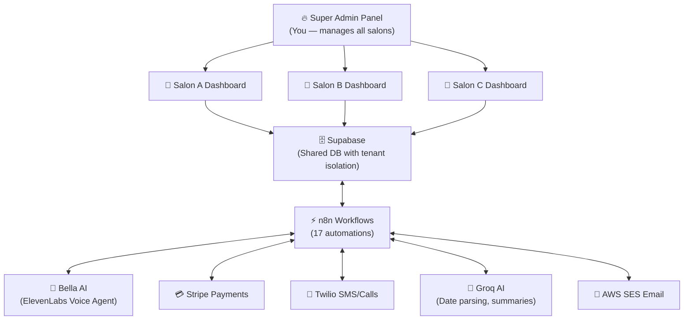

# 🔍 Voxali — Complete Project Audit Report

**Date:** February 17, 2026  
**Project:** Voxali — AI-Powered SaaS Salon Management Platform

---

## 📌 What Are We Building?

Voxali is a **multi-tenant SaaS platform** for salons. Each salon (tenant) gets:

- A **dashboard** for the owner/staff to manage bookings, clients, and analytics
- An **AI voice agent (Bella)** powered by ElevenLabs that handles phone calls, books appointments, takes payments
- **Automated workflows** via n8n for notifications, payments, and AI processing

On top of all that, **you (Super Admin)** manage all the salons from a single master panel.



---

## 📂 Project Folder Structure

| Folder | Contents | Files |
|--------|----------|-------|
| `dashboard/` | React + Vite + Tailwind frontend app | 19 components |
| `docs/sql-active/` | SQL scripts for database setup & fixes | 25 files |
| `n8n-workflows/` | n8n automation JSON exports | 17 files |
| `elevenlabs/` | Bella AI agent config + voice tools | 8 files |
| `email-templates/` | HTML email templates | 4 files |
| `docs/credentials/` | API keys & credentials | 9 files |
| `docs/guides/` | Implementation guides | 11 files |

---

## 🎨 Three Panels — Feature Breakdown

---

### 🔴 Panel 1: Super Admin Panel (Midnight Blue Theme)

> **Who uses it:** You (<super@voxali.com>)  
> **Purpose:** Manage all salons from one place

| Feature | Component | Data Source | Status |
|---------|-----------|-------------|--------|
| Dashboard Overview | [SuperAdminDashboard.tsx](file:///c:/Users/syeda/OneDrive/Desktop/Voxali%20New/dashboard/src/components/SuperAdmin/SuperAdminDashboard.tsx) | ⚠️ Partial DB + Mock | 🟡 60% |
| ├─ Active Salons count | — | ✅ `tenants` table (Supabase) | ✅ Done |
| ├─ Active Users count | — | ✅ `profiles` table (Supabase) | ✅ Done |
| ├─ Monthly Revenue | — | ❌ Hardcoded `$12,450` | ❌ Needs backend |
| ├─ Total AI Calls | — | ❌ Hardcoded `1,847` | ❌ Needs backend |
| ├─ Recent Activity | — | ❌ Hardcoded mock data | ❌ Needs backend |
| Tenants Management | [TenantsPage.tsx](file:///c:/Users/syeda/OneDrive/Desktop/Voxali%20New/dashboard/src/components/SuperAdmin/TenantsPage.tsx) | ✅ Supabase | 🟢 90% |
| ├─ List all tenants | — | ✅ Fetches from `tenants` table | ✅ Done |
| ├─ Search/filter tenants | — | ✅ Client-side filtering | ✅ Done |
| ├─ Impersonate tenant | — | ✅ localStorage + reload | ✅ Done |
| ├─ Delete/suspend tenant | — | ❌ Not implemented | ❌ Needs backend |
| Add New Tenant | [AddTenantModal.tsx](file:///c:/Users/syeda/OneDrive/Desktop/Voxali%20New/dashboard/src/components/SuperAdmin/AddTenantModal.tsx) | ✅ Supabase RPC | ✅ 100% |
| ├─ Creates tenant + owner | — | ✅ `rpc_create_tenant_and_owner` | ✅ Done |
| AI Monitor | [AIMonitorPage.tsx](file:///c:/Users/syeda/OneDrive/Desktop/Voxali%20New/dashboard/src/components/SuperAdmin/AIMonitorPage.tsx) | ❌ 100% Mock | 🔴 10% |
| ├─ AI calls per salon | — | ❌ Hardcoded mock data | ❌ Needs backend |
| ├─ Peak hours / trends | — | ❌ Hardcoded mock data | ❌ Needs backend |
| Salons List (Legacy) | [SalonsList.tsx](file:///c:/Users/syeda/OneDrive/Desktop/Voxali%20New/dashboard/src/components/SuperAdmin/SalonsList.tsx) | ✅ Supabase | ⚠️ Duplicate |

**Super Admin Backend TODO:**

1. Create `ai_call_logs` table to track Bella AI calls per tenant
2. Aggregate revenue across tenants from `bookings` table
3. Build real-time activity feed from `bookings` + `clients` + `call_logs`
4. Add tenant suspension/deletion RPC function

---

### 🟡 Panel 2: Salon Owner/Admin Dashboard (Gold Theme)

> **Who uses it:** Salon owners (owner/manager role)  
> **Purpose:** Run their entire salon business

| Feature | Component | Data Source | Status |
|---------|-----------|-------------|--------|
| **Login Page** | [LoginPage.tsx](file:///c:/Users/syeda/OneDrive/Desktop/Voxali%20New/dashboard/src/components/LoginPage.tsx) | ✅ Supabase Auth | ✅ 100% |
| ├─ Email + password login | — | ✅ `signInWithPassword` | ✅ Done |
| ├─ Session persistence | — | ✅ Supabase auto-session | ✅ Done |
| ├─ Tenant-branded login page | — | ✅ TenantContext branding | ✅ Done |
| **Dashboard Home** | [DashboardHome.tsx](file:///c:/Users/syeda/OneDrive/Desktop/Voxali%20New/dashboard/src/components/DashboardHome.tsx) | ✅ Supabase | ✅ 95% |
| ├─ Today's bookings count | — | ✅ `bookings` table | ✅ Done |
| ├─ Today's revenue | — | ✅ `bookings` table | ✅ Done |
| ├─ New clients this month | — | ✅ `clients` table | ✅ Done |
| ├─ AI calls today | — | ✅ `call_logs` table | ✅ Done |
| ├─ Revenue chart (7 days) | — | ✅ `bookings` aggregation | ✅ Done |
| ├─ Recent bookings list | — | ✅ `bookings` table | ✅ Done |
| ├─ Quick action cards | — | ✅ Navigation shortcuts | ✅ Done |
| **Bookings Calendar** | [BookingsCalendar.tsx](file:///c:/Users/syeda/OneDrive/Desktop/Voxali%20New/dashboard/src/components/BookingsCalendar.tsx) | ✅ Supabase | ✅ 95% |
| ├─ Day / Week / Month views | — | ✅ Client-side rendering | ✅ Done |
| ├─ Grid view by stylist | — | ✅ `staff` + `bookings` tables | ✅ Done |
| ├─ Walk-in booking creation | — | ✅ Inserts into `bookings` | ✅ Done |
| ├─ Confirm payment button | — | ✅ Updates `payment_status` | ✅ Done |
| ├─ Status badges (colors) | — | ✅ Client-side styling | ✅ Done |
| ├─ RBAC stylist-only view | — | ❌ Not filtered per stylist | ❌ Needs code |
| **Client CRM** | [ClientCRM.tsx](file:///c:/Users/syeda/OneDrive/Desktop/Voxali%20New/dashboard/src/components/ClientCRM.tsx) | ✅ Supabase | ✅ 100% |
| ├─ List all clients | — | ✅ `clients` table | ✅ Done |
| ├─ Search clients | — | ✅ Client-side filter | ✅ Done |
| ├─ Add new client | — | ✅ Insert into `clients` | ✅ Done |
| ├─ Edit client | — | ✅ Update `clients` | ✅ Done |
| ├─ Delete client | — | ✅ Delete from `clients` | ✅ Done |
| ├─ Export to PDF | — | ✅ jsPDF + autoTable | ✅ Done |
| ├─ Summary cards | — | ✅ Aggregated from data | ✅ Done |
| **Staff Board** | [StaffBoard.tsx](file:///c:/Users/syeda/OneDrive/Desktop/Voxali%20New/dashboard/src/components/StaffBoard.tsx) | ✅ Supabase | ✅ 100% |
| ├─ List all staff | — | ✅ `staff` table | ✅ Done |
| ├─ Add new staff | — | ✅ Insert into `staff` | ✅ Done |
| ├─ Block/unblock staff | — | ✅ `blocked_dates` table | ✅ Done |
| ├─ Deactivate/reactivate | — | ✅ `is_active` toggle | ✅ Done |
| ├─ Set commission rate | — | ✅ Updates `commission_rate` | ✅ Done |
| ├─ Create staff login | — | ✅ `rpc_create_staff_login` | ✅ Done |
| ├─ Change staff password | — | ✅ `rpc_change_user_password` | ✅ Done |
| ├─ Performance stats | — | ✅ Revenue + bookings count | ✅ Done |
| **Call Logs** | [CallLogs.tsx](file:///c:/Users/syeda/OneDrive/Desktop/Voxali%20New/dashboard/src/components/CallLogs.tsx) | ✅ Supabase | ✅ 90% |
| ├─ List all AI calls | — | ✅ `call_logs` table | ✅ Done |
| ├─ Filter by status | — | ✅ Client-side filtering | ✅ Done |
| ├─ Search by phone/keyword | — | ✅ Client-side search | ✅ Done |
| ├─ View transcript | — | ✅ Expandable panel | ✅ Done |
| ├─ Play recording | — | ⚠️ UI exists, needs `recording_url` | 🟡 Backend |
| **Analytics** | [Analytics.tsx](file:///c:/Users/syeda/OneDrive/Desktop/Voxali%20New/dashboard/src/components/Analytics.tsx) | ✅ Supabase | ✅ 95% |
| ├─ Revenue chart (30 days) | — | ✅ `bookings` aggregation | ✅ Done |
| ├─ Popular services chart | — | ✅ `bookings` by service | ✅ Done |
| ├─ Booking status pie chart | — | ✅ `bookings` by status | ✅ Done |
| ├─ Summary cards | — | ✅ Aggregated totals | ✅ Done |
| ├─ Export CSV | — | ✅ Client-side download | ✅ Done |
| **Marketing** | [Marketing.tsx](file:///c:/Users/syeda/OneDrive/Desktop/Voxali%20New/dashboard/src/components/Marketing.tsx) | ✅ Supabase | 🟡 70% |
| ├─ List campaigns | — | ✅ `campaigns` table | ✅ Done |
| ├─ Create campaign (draft) | — | ✅ Insert into `campaigns` | ✅ Done |
| ├─ Launch campaign | — | ⚠️ UI works, marks as "sent" | 🟡 Backend |
| ├─ Actually send SMS/email | — | ❌ Not connected to Twilio/SES | ❌ Needs backend |
| ├─ Audience filtering | — | ❌ Just labels, no real filter | ❌ Needs backend |
| **Bella AI Config** | [BellaAI.tsx](file:///c:/Users/syeda/OneDrive/Desktop/Voxali%20New/dashboard/src/components/BellaAI.tsx) | ✅ Supabase | ✅ 90% |
| ├─ Edit system prompt | — | ✅ `agent_config` table | ✅ Done |
| ├─ Edit announcements | — | ✅ `agent_config` table | ✅ Done |
| ├─ Enable/disable agent | — | ✅ `is_active` toggle | ✅ Done |
| ├─ Reset to default | — | ✅ Client-side reset | ✅ Done |
| ├─ Push to ElevenLabs | — | ❌ Not connected to API | ❌ Needs backend |
| **Settings** | [Settings.tsx](file:///c:/Users/syeda/OneDrive/Desktop/Voxali%20New/dashboard/src/components/Settings.tsx) | ✅ Supabase | ✅ 95% |
| ├─ Salon branding (name, logo) | — | ✅ `rpc_update_branding` | ✅ Done |
| ├─ Logo upload (base64) | — | ✅ Client-side + `tenants` | ✅ Done |
| ├─ Service management (CRUD) | — | ✅ `services` table | ✅ Done |
| ├─ Toggle service active | — | ✅ `is_active` field | ✅ Done |
| ├─ Business hours | — | ✅ `business_hours` table | ✅ Done |
| ├─ Owner-only restriction | — | ❌ Any role can access | ❌ Needs RBAC |

**Admin Dashboard Backend TODO:**

1. Connect Marketing campaign launch to actual Twilio SMS / AWS SES email sending
2. Connect Bella AI config save to ElevenLabs API (push prompt updates)
3. Add RBAC filtering (stylist sees only their bookings, Settings owner-only)
4. Call recording playback (store `recording_url` from ElevenLabs/Vapi)

---

### 🟢 Panel 3: Stylist Dashboard (Gold Theme, Limited)

> **Who uses it:** Staff members (staff/stylist role)  
> **Purpose:** View their own schedule and bookings

Currently **there is no separate stylist panel** — stylists login to the same salon dashboard but with limited sidebar items. The Sidebar already filters by role:

| Sidebar Item | Owner | Manager | Staff |
|-------------|-------|---------|-------|
| Dashboard | ✅ | ✅ | ❌ |
| Bookings | ✅ | ✅ | ✅ |
| Clients | ✅ | ✅ | ❌ |
| Stylists | ✅ | ✅ | ❌ |
| Analytics | ✅ | ✅ | ❌ |
| Call Logs | ✅ | ✅ | ❌ |
| Marketing | ✅ | ✅ | ❌ |
| Bella AI | ✅ | ✅ | ❌ |
| Settings | ✅ | ❌ | ❌ |

**Stylist Backend TODO:**

1. Filter bookings by `stylist_id` when role is `staff` (currently shows ALL bookings)
2. Add a stylist-specific dashboard view (today's appointments, earnings)
3. Add Receptionist role access (Clients + Call Logs only)

---

## ⚙️ Backend Architecture Breakdown

### Authentication Logic

| Component | How It Works |
|-----------|-------------|
| [AuthContext.tsx](file:///c:/Users/syeda/OneDrive/Desktop/Voxali%20New/dashboard/src/context/AuthContext.tsx) | Gets session → fetches `profiles` table → sets `role` → renders correct panel |
| Timeout handling | 5-second timeout on every Supabase query (prevents RLS hang) |
| Email fallback | If profile query hangs, uses session email to determine role |
| localStorage recovery | If `getSession()` fails, reads Supabase's `sb-*-auth-token` from localStorage |
| Impersonation | Super Admin sets `admin_viewing_tenant` + `voxali_impersonate_tenant` in localStorage → sees salon dashboard with "Back" bar |

### Database (Supabase)

| Table | Purpose | Used By |
|-------|---------|---------|
| `tenants` | Salon info (name, branding, hours) | TenantContext, SuperAdmin |
| `profiles` | User accounts + roles | AuthContext, Login |
| `staff` | Staff members per salon | StaffBoard, BookingsCalendar |
| `services` | Services (price, duration) | Settings, BookingsCalendar |
| `bookings` | All appointments | Calendar, Dashboard, Analytics |
| `clients` | Client database | ClientCRM |
| `call_logs` | Bella AI call history | CallLogs, Dashboard |
| `campaigns` | Marketing campaigns | Marketing |
| `agent_config` | Bella AI settings | BellaAI |
| `business_hours` | Weekly open/close times | Settings |
| `blocked_dates` | Staff days off | StaffBoard |

### External Services

| Service | Purpose | Credentials | Status |
|---------|---------|-------------|--------|
| **Supabase** | Database + Auth | ✅ In `.env` | ✅ Connected |
| **ElevenLabs** | Bella AI voice agent | ✅ In `elevenlabs/` | ⚠️ Config only |
| **n8n** | Workflow automation | ✅ Self-hosted | ⚠️ Hardcoded tenant |
| **Stripe** | Payment processing | ✅ In `docs/credentials/` | ⚠️ Webhook needed |
| **Twilio** | SMS notifications | ✅ In `docs/credentials/` | ❌ Not connected |
| **AWS SES** | Email sending | ✅ In `docs/credentials/` | ❌ Not connected |
| **Groq** | AI date parsing/summaries | ✅ In `docs/credentials/` | ❌ Not connected |

---

## 📊 Overall Completion Summary

| Category | Done | Partial | Not Started | Total |
|----------|------|---------|-------------|-------|
| **Super Admin Panel** | 3 features | 2 features | 4 features | 9 |
| **Salon Dashboard** | 38 features | 4 features | 5 features | 47 |
| **Stylist Dashboard** | 1 feature (sidebar filter) | 1 feature | 2 features | 4 |
| **n8n Workflows** | 3 working | 7 need tenant update | 7 need service connection | 17 |
| **Database** | 17 tables ready | RLS needs fix | `ai_call_logs` missing | — |

### Frontend: **~85% Complete** ✅

### Backend Connected: **~65% Complete** 🟡

### Full Production Ready: **~45%** 🔴

---

## 🔧 Remaining Work — How To Do It

### Priority 1: 🔴 Fix RLS (Profiles table) — Supabase SQL Editor

```sql
ALTER TABLE profiles DISABLE ROW LEVEL SECURITY;
DROP POLICY IF EXISTS "allow_authenticated_all" ON profiles;
ALTER TABLE profiles ENABLE ROW LEVEL SECURITY;
CREATE POLICY "allow_authenticated_all" ON profiles 
  FOR ALL TO authenticated USING (true) WITH CHECK (true);
NOTIFY pgrst, 'reload schema';
```

> This fixes the 10-second loading delay on every page refresh.

### Priority 2: 🔴 Dynamic Tenant in n8n

- **Every** n8n workflow has a hardcoded tenant ID
- Change all "Parse Input" nodes to extract `tenant_id` from the webhook payload
- Without this, second salon breaks everything

### Priority 2.5: 🔴 n8n Security + Data Integrity *(Gemini Recommendation)*

- **Move hardcoded API keys** from HTTP nodes to n8n Generic Credentials (security)
- **Save price snapshots** in `booking_items` table when creating bookings:
  - When booking is created, store `service_price` and `service_duration` at that moment
  - This prevents old bookings from showing wrong amounts if owner later changes price
- **Standardize webhook responses** — Bella AI needs fast, minimal responses (`{ok: true, booking_id: "..."}`)

### Priority 3: 🟡 Connect Marketing to Twilio/SES

- Marketing page creates campaigns in DB but doesn't actually send
- Need an n8n workflow or Edge Function to:
  1. Query target clients from `clients` table
  2. Send SMS via Twilio / Email via AWS SES

### Priority 4: 🟡 RBAC Completion

- Stylist should only see their own bookings (filter by `stylist_id`)
- Settings page should be owner-only
- Manager should not access Staff management

### Priority 5: 🟡 Super Admin Real Data

- Create `ai_call_logs` table
- Replace mock data in SuperAdminDashboard with real aggregations
- Replace mock data in AIMonitorPage with real `call_logs` counts per tenant

### Priority 6: 🟢 Stripe & Payment Integration

- Configure Stripe webhook endpoint
- Connect `stripe_payment_webhook.json` n8n workflow
- Set up "Pay at Salon" booking flow (status: `pending_confirmation`)

### Priority 7: 🟢 Bella AI → ElevenLabs Sync

- BellaAI config page saves prompts to DB
- Need API call to push updated prompt to ElevenLabs agent

---

## 📁 Every File In The Project

### Dashboard Source (`dashboard/src/`)

| File | Size | Purpose |
|------|------|---------|
| `App.tsx` | 8.9KB | Main app routing + auth logic |
| `main.tsx` | 230B | React entry point |
| `index.css` | 2KB | Global CSS + theme vars |
| `App.css` | 606B | App-level styles |
| **components/** | | |
| `LoginPage.tsx` | 7.8KB | Login form w/ branding |
| `Sidebar.tsx` | 7.8KB | Navigation w/ role filtering |
| `DashboardHome.tsx` | 15KB | Dashboard stats + charts |
| `BookingsCalendar.tsx` | 30KB | Calendar w/ day/week/month |
| `ClientCRM.tsx` | 25KB | Client CRUD + PDF export |
| `StaffBoard.tsx` | 35KB | Staff management |
| `CallLogs.tsx` | 21KB | AI call history viewer |
| `Analytics.tsx` | 14KB | Charts + CSV export |
| `Marketing.tsx` | 17KB | Campaign manager |
| `BellaAI.tsx` | 10KB | AI agent configuration |
| `Settings.tsx` | 29KB | Branding + services + hours |
| **components/SuperAdmin/** | | |
| `SuperAdminLayout.tsx` | 5.2KB | SA panel layout + routing |
| `SuperAdminDashboard.tsx` | 5.9KB | SA overview stats |
| `TenantsPage.tsx` | 9.1KB | Tenant list + search |
| `AddTenantModal.tsx` | 7.8KB | New tenant creation form |
| `AIMonitorPage.tsx` | 6.1KB | AI usage monitor (mock) |
| `SalonsList.tsx` | 12KB | Salons list (legacy) |
| **components/ui/** | | |
| `ConfirmModal.tsx` | 3KB | Confirmation dialog |
| `ToastNotification.tsx` | 4.4KB | Toast notifications |
| **context/** | | |
| `AuthContext.tsx` | 9KB | Auth state + role detection |
| `TenantContext.tsx` | 2.8KB | Tenant branding loader |
| **config/** | | |
| `constants.ts` | 362B | TENANT_ID, timezone, commission |
| **lib/** | | |
| `supabase.ts` | 828B | Supabase client init |

### n8n Workflows (`n8n-workflows/`)

| File | Purpose | Status |
|------|---------|--------|
| `tools_check_availability.json` | Check open slots | ⚠️ Hardcoded tenant |
| `tools_create_booking.json` | Create a booking | ⚠️ Hardcoded tenant |
| `tools_cancel_booking.json` | Cancel a booking | ⚠️ Hardcoded tenant |
| `tools_reschedule_booking.json` | Reschedule booking | ⚠️ Hardcoded tenant |
| `tools_add_to_waitlist.json` | Add to waitlist | ⚠️ Hardcoded tenant |
| `tools_confirm_booking.json` | Confirm a booking | ⚠️ Hardcoded tenant |
| `tools_create_payment_link.json` | Stripe payment link | ⚠️ Needs Stripe config |
| `tools_mark_manual_payment.json` | Mark paid in dashboard | ⚠️ Hardcoded tenant |
| `tools_ai_parse_date.json` | Parse "next Friday" → date | ❌ Needs Groq |
| `tools_ai_polish_sms.json` | Polish SMS messages | ❌ Needs Groq |
| `tools_ai_summarize_notes.json` | Summarize client notes | ❌ Needs Groq |
| `notifications_send.json` | Send SMS/email notifications | ❌ Needs Twilio/SES |
| `stripe_payment_webhook.json` | Handle Stripe callbacks | ❌ Needs Stripe webhook |
| `cron_release_expired_holds.json` | Release expired bookings | ✅ Working |
| `error_handler.json` | Log workflow errors | ⚠️ Needs setup |
| `timezone_conversion_code.js` | Timezone helpers | ✅ Ready |
| `timezone_conversion_code_fixed.js` | Timezone helpers v2 | ✅ Ready |

### ElevenLabs Tools (`elevenlabs/`)

| File | Purpose |
|------|---------|
| `bella_agent_config.md` | Full Bella AI system prompt |
| `bella_timezone_prompt_update.txt` | Timezone-aware prompt |
| `tool_check_availability.json` | Webhook: check slots |
| `tool_create_booking.json` | Webhook: create booking |
| `tool_cancel_booking.json` | Webhook: cancel booking |
| `tool_reschedule_booking.json` | Webhook: reschedule |
| `tool_create_payment_link.json` | Webhook: payment link |
| `tool_add_to_waitlist.json` | Webhook: waitlist |

### Email Templates (`email-templates/`)

| File | Purpose |
|------|---------|
| `booking-confirmation.html` | Booking confirmed email |
| `booking-cancelled.html` | Booking cancelled email |
| `booking-rescheduled.html` | Booking rescheduled email |
| `payment-reminder.html` | Payment reminder email |

---

## 🤖 Gemini AI Architect Recommendations

*These recommendations came from sharing this audit with a Gemini AI Product Architect:*

| # | Recommendation | Impact | Status |
|---|---------------|--------|--------|
| 1 | **Standardize Parse Input** — All n8n workflows should extract `tenant_id` from body/headers/query uniformly | 🔴 Critical | Added to Priority 2 |
| 2 | **Move API keys to Credentials** — Stop hardcoding Supabase `apikey` in every HTTP node | 🔴 Security | Added to Priority 2.5 |
| 3 | **Price Snapshots in booking_items** — Store price & duration at booking time to protect historical data | 🟡 Data Integrity | Added to Priority 2.5 |
| 4 | **Minimal Webhook Responses** — Bella AI needs fast responses, strip unnecessary data | 🟡 Performance | Added to Priority 2.5 |

---

> **Bottom line:** The frontend is very mature — almost every page works with real Supabase data. The biggest gaps are: (1) fixing RLS so page refresh is instant, (2) making n8n multi-tenant + secure, (3) ensuring booking price integrity, (4) connecting Marketing/Bella to external APIs, and (5) adding proper RBAC for stylists.
